#  Gematik IDP Zulassungstestsuite v8.2.0

Die Gematik IDP Zulassungstestsuite dient zur Pr&uuml;fung externer IDP Dienst Drittanbieter. Sie ist derzeit in
Entwicklung und noch **NICHT** fertiggestellt. Ziel der Suite ist es sowohl externe IDP Dienste, als auch die Gematik
interne Referenzimplementierung bezüglich ihrer Eignung als IDP Dienst in der TI Umgebung zu testen.

## Informationen zum IDP Dienst

[Produkübersicht (intern)](https://confluence.int.gematik.de/display/DEV/IDP+-+Aufbau)

Folgende Endpunkte sind von einem IDP Dienst zur Verfügung zu stellen:

* Discovery-Endpunkte (TI und Internet) ("OAuth 2.0 Authorization Server Metadata" [RFC8414])
* Authorization-Endpunkt(e) (Teil des "The OAuth 2.0 Authorization Framework" [RFC6749])
* Token-Endpunkt(e) [RFC6749 # section-3.2] mit
    * "ID_TOKEN" [openid-connect-core 1.0 # IDToken],
    * "ACCESS_TOKEN" [RFC6749 # section-1.4 & RFC6749 # section-5],
    * "REFRESH_TOKEN/SSO_TOKEN" [RFC6749 # section-1.5 & RFC6749 # section-6]

Weiterführende interne Dokumente

* [gemSpec_IDP_Dienst](https://polarion.int.gematik.de/polarion/#/project/Mainline_OPB1/wiki/Spezifikation/gemSpec_IDP_Dienst)
* [Testkonzept](https://confluence.int.gematik.de/display/DEV/IDP+Testkonzept?src=contextnavpagetreemode)
* [Testspezifikation](https://confluence.int.gematik.de/display/DEV/IDP+Testspezifikation?src=contextnavpagetreemode)

#### Relevante RFCs

* [RFC6749](https://tools.ietf.org/html/rfc6749) ist der allgemeine OAuth 2.0 RFC. Hier werden die Endpunkte (
  Authorization-Endpoint, Token-Endpoint, ...) beschrieben
* [RFC7636](https://tools.ietf.org/html/rfc7636) beschreibt einen Schutzmechanismus gegen das Abfangen von Authorization
  Codes. Es wird mit code_verifier gearbeitet und die damit verbundenen Änderungen am Authorization-Request finden sich
  in diesem RFC
* [RFC8252](https://tools.ietf.org/html/rfc8252) beschreibt, wie Native Apps OAuth 2.0 machen sollen.
* [RFC8414](https://tools.ietf.org/html/rfc8414) beschreibt, wie man über einen Discovery-Endpunkt die relevanten
  Endpunkte ermittelt.
* [RFC7519 Appendix A.2](https://tools.ietf.org/html/rfc7519#appendix-A.2) beschreibt, wie das Challenge-Token zu
  signieren und verschlüsseln ist (Nested JWT).
* [RFC7515 Ssection 3](https://tools.ietf.org/html/rfc7515#section-3) beschreibt die zu verwendende Form der Signatur (
  JSON Web Signature)
* [RFC7516 Section 3](https://tools.ietf.org/html/rfc7516#section-3) beschreibt die zu verwendende Form der
  Verschlüsslung (JSON Web Encryption)

## Testüberdeckung

mit dem aktuellen Release sind folgende Testszenarien abgedeckt:

* Discovery Endpunkt
    * Tests über Erreichbarkeit des Endpunkts, Struktur der Antwort, Inhalte der Claims, Signaturen, zeitliche
      Gültigkeit, Token Verschlüsselung
    * _In Arbeit: ungültige Zertifikate, Fehlermeldungen_
* Authorization Endpunkt - Anforderung Challenge Token
    * Tests über Erreichbarkeit des Endpunkts, Eingangsparameter, Struktur der Antwort, Inhalte der Claims, Signaturen,
      Negativtests auf Parameter, Fehlermeldungen, zeitliche Gültigkeit, Token Verschlüsselung
    * _In Arbeit: Fehlermeldungen_
    * _Noch nicht realisiert: kartenspezifische Szenarien_
* Authorization Endpunkt - Anforderung Tokencode
    * Tests über Erreichbarkeit des Endpunkts, Eingangsparameter, beide Flows (signed challenge, sso token), Signaturen,
      Negativtests auf Parameter, Fehlermeldungen, zeitliche Gültigkeit, ungültige Zertifikate, Token Verschlüsselung
    * _Abzuklären: Struktur der Antwort, Inhalte der Claims_
    * _In Arbeit: Fehlermeldungen_
    * _Noch nicht realisiert: ungültiger SSO Token_
* Token Endpunkt - Anforderung Access Token
    * Tests über Erreichbarkeit des Endpunkts, Eingangsparameter, beide Flows (signed challenge, sso token),
      Signaturen (ID Token), Negativtests auf Parameter, zeitliche Gültigkeit, Ungültige Zertifikate, Token
      Verschlüsselung
    * _Abzuklären: Struktur der Antwort, Inhalte der Claims_
    * _In Arbeit: Fehlermeldungen_
    * _Noch nicht realisiert: kartenspezifische Szenarien_
* Alternative Authentisierung
    * Erster Draft
    * _Abzuklären: Validierungsschritte am Server_
    * _Noch nicht realisiert: Vollständige Umsetzung der Testszenarien, Fehlermeldungen_
* Pairing Endpunkt - Registrierung / Deregistrierung / Liste
    * Positivfälle, Einige Negativtests
    * _Abzuklären: Validierungsschritte am Server_
    * _Noch nicht realisiert: Vollständige Umsetzung der Testszenarien, Fehlermeldungen_

Noch nicht realisiert:

* CR Biometrie / Szenarien für Block/Allow-List und deren Administration

## Installation der notwendigen Software

* OpenJDK 11 (latest, 11.0.9)
* Maven (latest, 3.6.3)
* Jetbrains Intellij (optional, Latest, 2020.3)
* Git für Windows (optional, latest, 2.30.0)

## Konfiguration der Entwicklungsumgebung (IntelliJ)

### Cucumber Run Template anpassen

Die Default CucumberJava Debug/Run Umgebung anpassen:

Auf Add Configuration klicken


Im sich öffnenden Dialog auf den Schraubenschlüssel

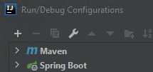

Cucumber Java auswählen

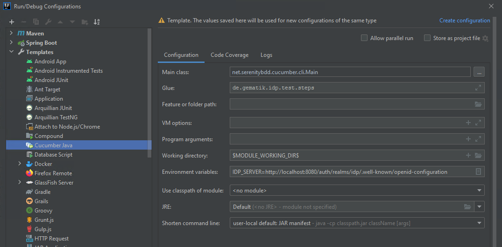

und folgende Werte in die entsprechenden Felder rechts eintragen:

```
Main class           :  net.serenitybdd.cucumber.cli.Main

Glue                 : de.gematik.idp.test.steps

Environment variables: IDP_SERVER=http://localhost:8080/auth/realms/idp/.well-known/openid-configuration
```

## Idp Server lokal starten

* Projekt in Intellij öffnen

 Beim ersten Mal kann es einige Zeit dauern, bis alle Projektabhängigkeiten
von Internet/Gematik Nexus Repos gezogen wurden.

* Den Verzeichnisbaum idp-server → src → main → java → de.gematik.idp.server aufklappen
* Rechte Maus auf die Datei IdpServer
* 'Run IdpServer' auswählen

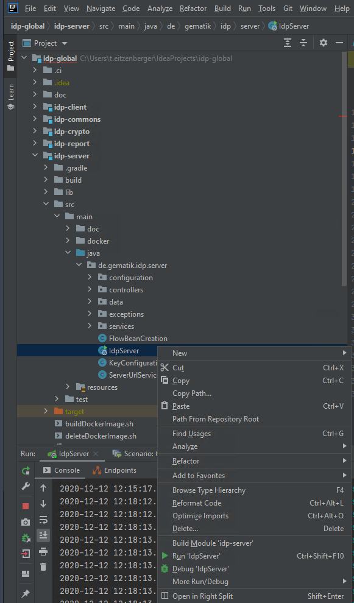

Im Run Fenster sind die Logs des gestarteten Servers sichtbar:

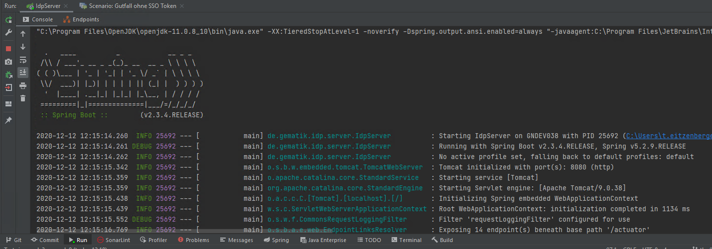

Der IdpServer kann für Analysetätigkeiten statt Run auch mit Debug gestartet werden. Dadurch können im IdpServer code
breakpoints gesetzt und Code schrittweise ausgeführt werden.

 Sollte es zu Fehlermeldungen beim Start des Servers kommen evt. mvn clean
install im idp-global ausführen und anschließend den Start nochmals probieren

## Testszenarien / Testsuite ausführen

### Gesamte Testsuite in der IDE ausführen

* Rechte Maus auf das Verzeichnis idp-testsuite
* Run → All Features in: idp-testsuite

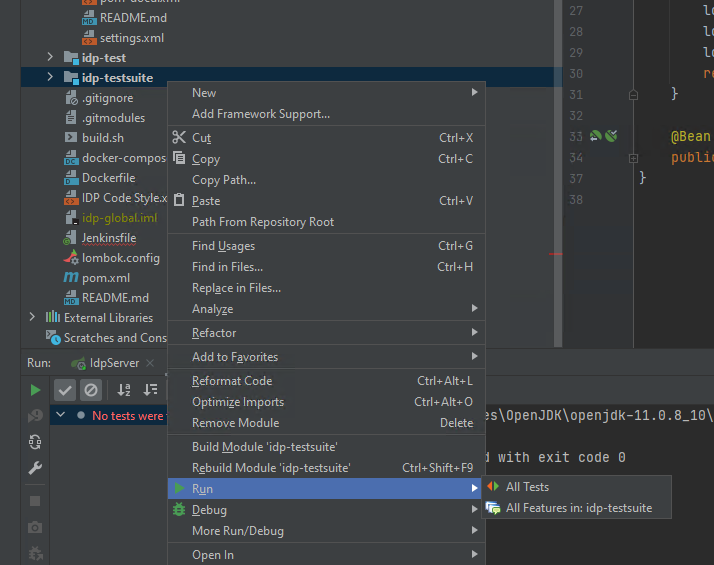

Voila, im Run Fenster tauchen nun die Testfälle/Szenarien auf:

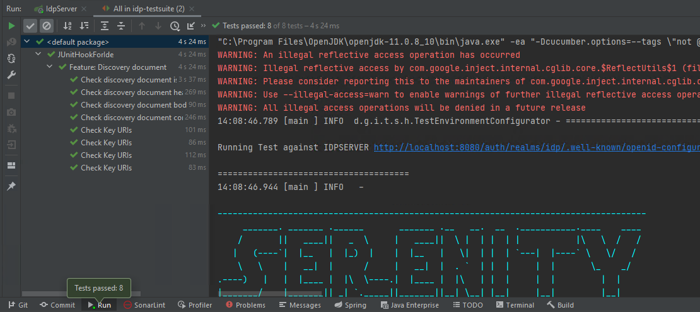

### Einzelne Testsuite Szenarien debuggen

Um einzelne Szenarien zu debuggen,

* die entsprechende feature Datei im Verzeichnis idp-testsuite → src → test → resources → features die entsprechende
  feature Datei öffnen
* in der "Scenario" Zeile mit der rechten Maus aus dem Kontextmenü "Debug 'Scenario: ......'" auswählen.
* oder links neben der Zeilennummer auf den grünen Pfeil klicken

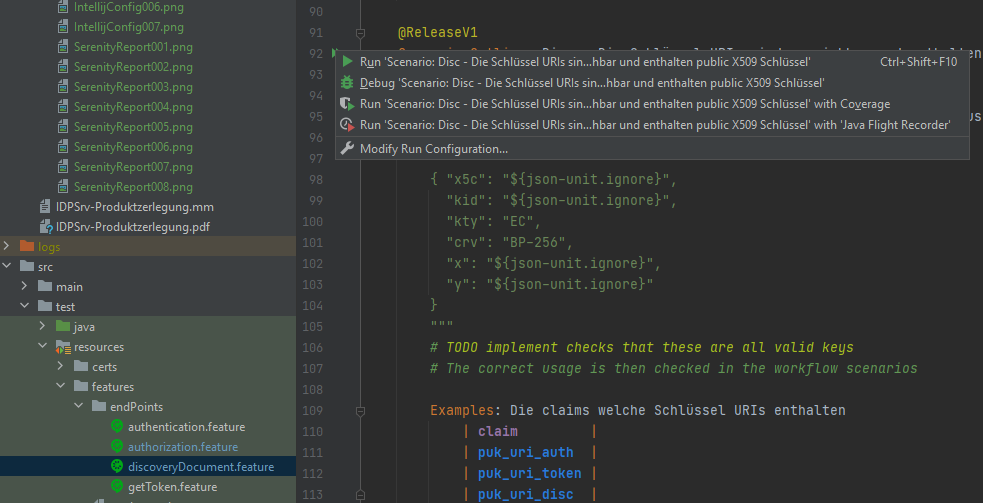

 Breakpoints im Glue code werden zwar respektiert, allerdings ist ein
einfaches reinsteppen in die aufrufenden Methoden so nicht möglich, da der Glue Code instrumentiert wird. Daher am
Besten in der aufzurufenden Methode auch einen Breakpoint setzen und den Test weiterlaufen lassen.

### Gesamte Testsuite via Maven in Git Bash ausführen

Um einen Idp Server zu testen muss die Umgebungsvariable IDP_SERVER entsprechend gesetzt sein und dort auch laufen.

* In der Git Bash ins IdeaProjects/idp-global Verzeichnis wechseln
* Die Environment Variable setzen
* Maven ausführen

```
cd ......./idp-global
export IDP_SERVER=http://localhost:8080/auth/realms/idp/.well-known/openid-configuration
mvn clean verify -Dskip.unittests=true
```

Beim obigen Aufruf ohne cucumber options werden nur freigegebene Tests ausgeführt. Szenarien, welche bereits bekannte
Fehler (@OpenBug) enthalten bzw. noch in Arbeit (@WiP) oder nicht freigegeben sind, werden dabei NICHT ausgeführt. Um
alle derzeit in der Testsuite vorhandenen und teilweise noch in Entwicklung befindlichen Testfälle auszuführen dient
folgender mvn Aufruf:

````
mvn clean verify -Dcucumber.filter.tags="" -Dskip.unittests=true
````

 Im Gegensatz zur IDE Methode, laufen die Tests via Maven parallel ab.

## Serenity Testbericht

### Testbericht erstellen

Der Testbericht ist aus der Git Bash im idp-global Verzeichnis mit folgendem Kommando einsehbar:

```
start chrome ./idp-testsuite/target/site/serenity/index.html
```

 Der Testbericht wird nur über den maven Aufruf automatisch
miterstellt/aktualisiert. Beim Aufruf der Testsuite über die IDE wird KEIN Bericht erstellt. Dieser muss manuell
getriggert werden.

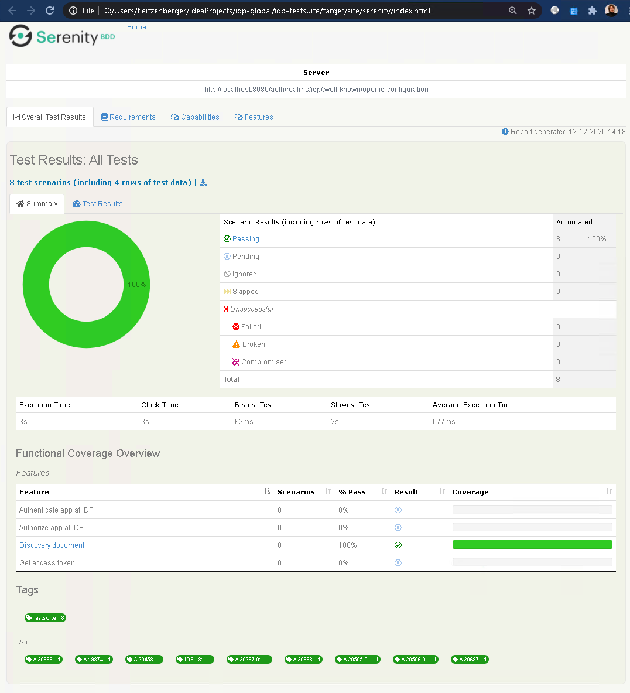

Zum Erstellen des Berichts aus der IDE kann das unten verfügbare Skript als showReport.bat im idp-testsuite Ordner
abgespeichert und genutzt werden (Startet defaultmäßig Chrome):

```
  @REM showReport.bat:
  @REM helper script to show serenity report from IDE

  @echo off
  call mvn serenity:aggregate
  start chrome %cd%\target\site\serenity\index.html
```

Hierzu in der Dropdownbox rechts oben "Edit Configuration..." auswählen

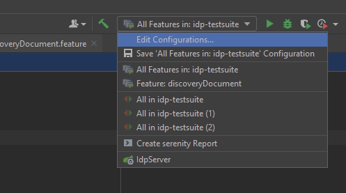

Im erscheinenden Dialog dann auf das "+" links oben klicken und "Shell Script" auswählen

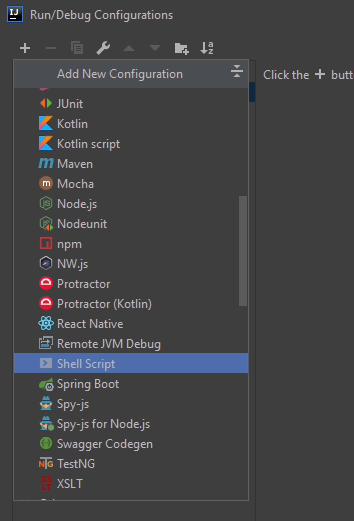

Und rechts folgende Werte eintragen

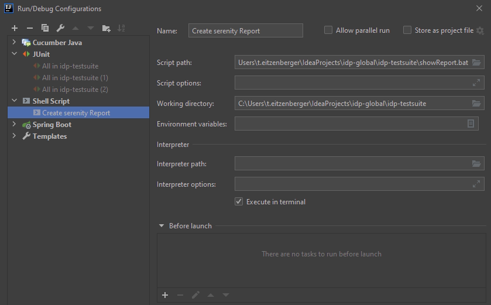

```
Name             : Create Serenity report
Script path      : C:\Users\$USER\IdeaProjects\idp-global\idp-testsuite\showReport.bat 
Working directory: C:\Users\$USER\IdeaProjects\idp-global\idp-testsuite
```

 Der Pfad zum Skript ist evt. anzupassen, wenn die bat nicht in das
idp-testsuite Verzeichnis gespeichert wurde

Ab nun kann mit der IDE der Serenity report erstellt/aktualisiert werden und wird am Ende automatisch im Chrome
dargestellt.

### Testbericht analysieren

#### Übersichtsseite(n)

Die Übersichtsseite besteht aus folgenden Sektionen:

##### Test Results: All Tests

Hier ist der gesamte Testlauf mit allen statistischen Daten und einem netten PieChart aufgelistet

##### Functional Coverage Overview

Zeigt eine Liste aller Features die gefunden/getestet wurden.

##### Tags

Hier sind alle in den Feature Dateien verwendeten Tags aufgelistet. Für uns vor allem interessant ist die Afo Sektion wo
alle eingetragenen Afos und die Issue Sektion wo alle mit Jira verlinkten Tickets gelistet sind. Ein Klick auf den
konkreten Tag zeigt die zugehörige Übersichtsseite. Ein Klick auf Test Results zeigt dann alle verlinkten Szenarien.

 Um in der Feature Ansicht die Testfälle zu sehen muss oben "Test Results"
ausgewählt werden. Um das konkrete Szenario im Detail zu sehen, dann in der Liste in der Spalte "SCENARIO" klicken!

#### Testschrittdetails

Durch Klicken auf die links angezeigten "+" icons können weiterführende Details zu den Testschritten aufgeklappt werden.


Für HTTP Anfragen wird neben dem **"REST Query"** Knopf der von Serenity erstellt wird und die ausgeführten REST Abfrage
detailliert darstellt auch ein **"cURL"** Knopf dargestellt, welcher einen ausführbaren REST Query mit Curl erlaubt um
etwaige Fehler nachzustellen.


Für Stacktrace Informationen gibt es rechts in den Details auch den **"More Details"** Knopf


## Anpassung der Testsuite an Drittanbieter

### Lokales Discovery Dokument

Zur Anpassung an Abweichungen von Drittanbietern im Vergleich zur Referenzimplementierung gibt es die Möglichkeit ein
angepasstes Discovery Dokument aus dem Dateisystem der Testsuite zur Verfügung zu stellen und unter Umgehung der
PUK_URIS öffentliche Schlüssel direkt aus dem Dateisystem in die Testumgebung zu laden. Diese Daten müssen natürlich mit
den Einstellungen des Servers korrelieren, um einen erfolgreichen Lauf der Testsuite sicherzustellen.

Hierfür muss die Umgebungsvariable IDP_LOCAL_DISCDOC auf ein Set von Dateien, welche den Inhalt des Discovery Dokuments
enthalten verweisen. Für relative Pfade ist als Ausgangsordner idp-testsuite anzusetzen.

Basierend auf dieser Umgebungsvariable werden drei Dateien erwartet:

```
{IDP_LOCAL_DISCDOC}_body.json
{IDP_LOCAL_DISCDOC}_header.json
{IDP_LOCAL_DISCDOC}_pkey.p12
```

Für die Signierung des Discovery Documents wird ein privater Schlüssel in der p12 Datei erwartet. Das Passwort für den
Schlüssel kann über die Umgebungsvariable IDP_LOCAL_DISCDOC_PKEY_PWD festgelegt werden.

Die zeitlichen Validierungs-Claims (exp, iat, nbf) werden von der Testsuite dynamisch ergänzt.

Im idp-testsuite Ordner gibt es für den Referenzserver Beispieldateien `discover_document*.*`, welche die Schlüssel vom
lokal zu startenden Server nutzt.

Das Testszenario "Disc - Die Schlüssel URIs sind erreichbar und enthalten public X509 Schlüssel" scheitert naturgemäß
bei der Verwendung von dateibasierten Referenzen. Deswegen ist dieses Szenario derzeit mit einer @OpenBug Annotation
versehen.

Bei der Verwendung der IDP_LOCAL_DISCDOC Funktionalität, ist trotzdem eine IDP_SERVER Umgebungsvariable zu setzen (dummy
Wert) um ein temporäres Hochfahren des Referenzservers (auf einem anderen Port) beim Lauf der Testsuite zu unterbinden.

```
export IDP_SERVER=1
```

~~### Abweichende Pfade an den Endpunkten~~

~~Sollten die Pfade zu den Anfragen an die Endpunkte vom Standardwert ("") abweichen so können diese in der
`testsuite_config.properties` Datei im idp-testsuite Ordner angepasst werden.~~

~~Zum Aktivieren der entsprechenden Settings ist die Umgebungsvariable IDP_SERVER_TYPE zu setzen. Der Wert entspricht
dem ersten Teil der Properties Gruppe in der property Datei.~~

**DEPRECATED since v7.0.0**

```
export IDP_SERVER_TYPE=rise
```

### Deaktivieren der Tokenverschlüsselung

In der aktuellen Version der Referenzimplementierung werden die Tokens bereits verschlüsselt. Die Testsuite ist
daraufhin abgestimmt und nimmt automatisch die Ver-/Entschlüsselung vor. Um dies abzuschalten, kann im
testsuite_config.properties folgender Eintrag gesetzt werden.

```
encryption.token.active=0
```

Das für die symmetrische Verschlüsselung zu verwendende Passwort wird in folgendem Eintrag gesetzt:

```
encryption.symmetric.key=geheimerSchluesselDerNochGehashtWird
```

## Remarks

* Die verwendeten Icons stammen von Freepik(www.flaticon.com) und vom Ubuntu Gnome icon set
