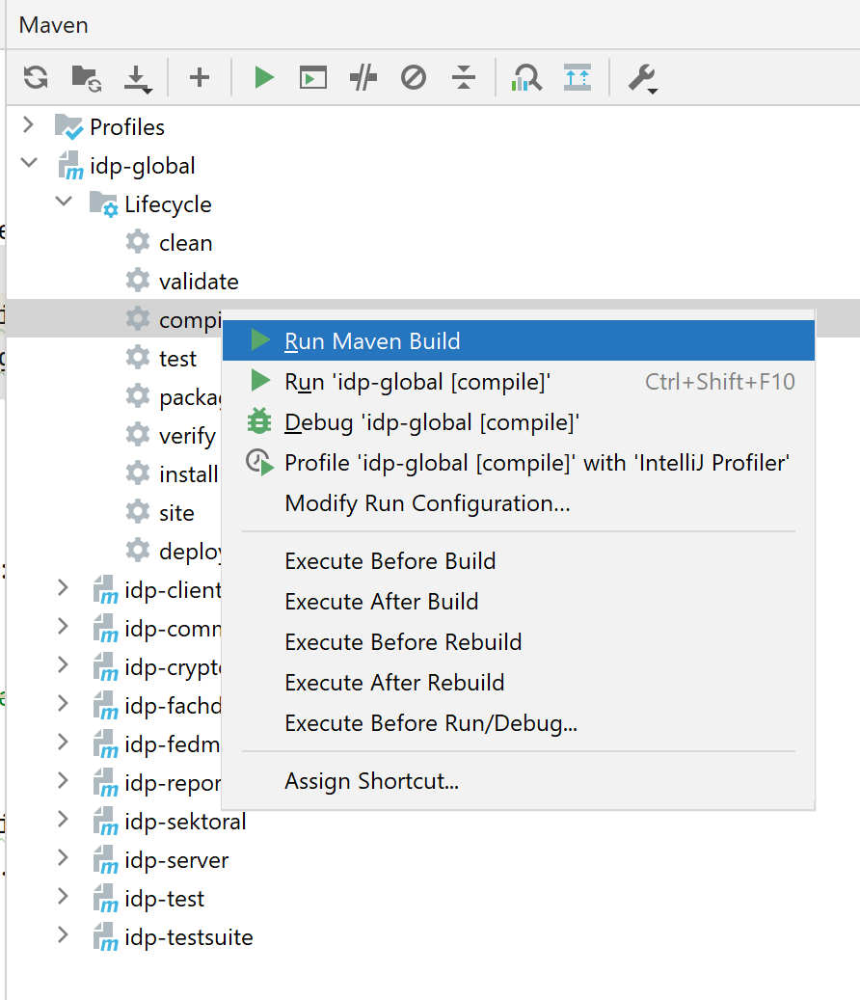
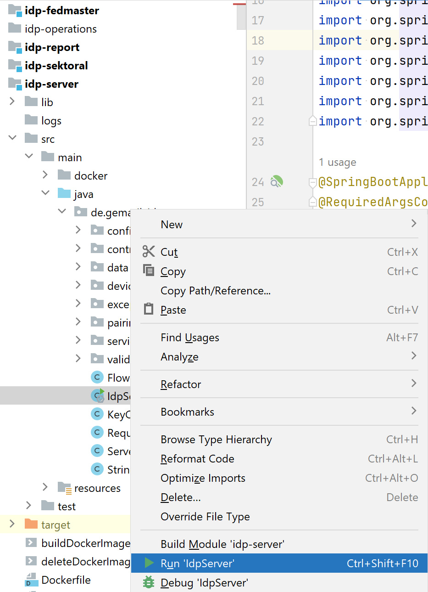
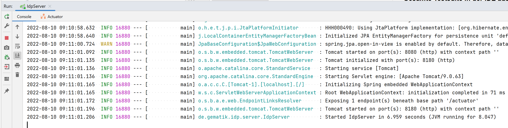
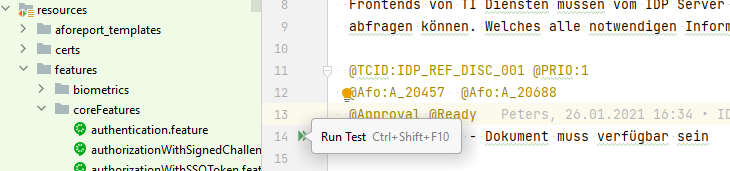
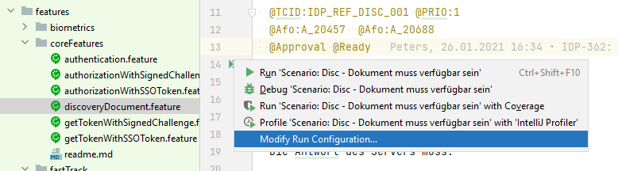
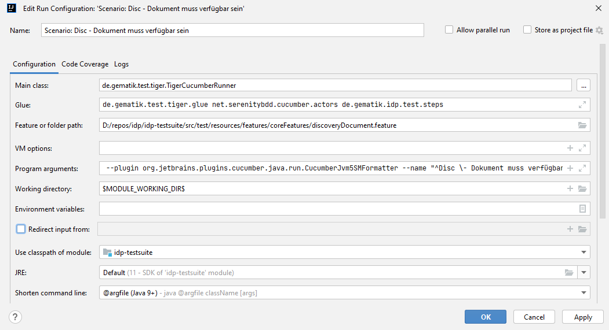
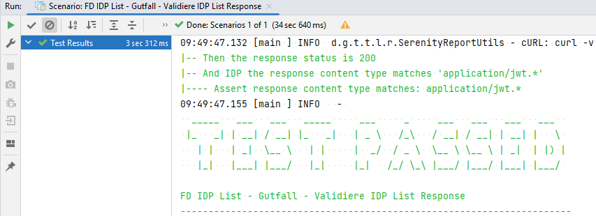
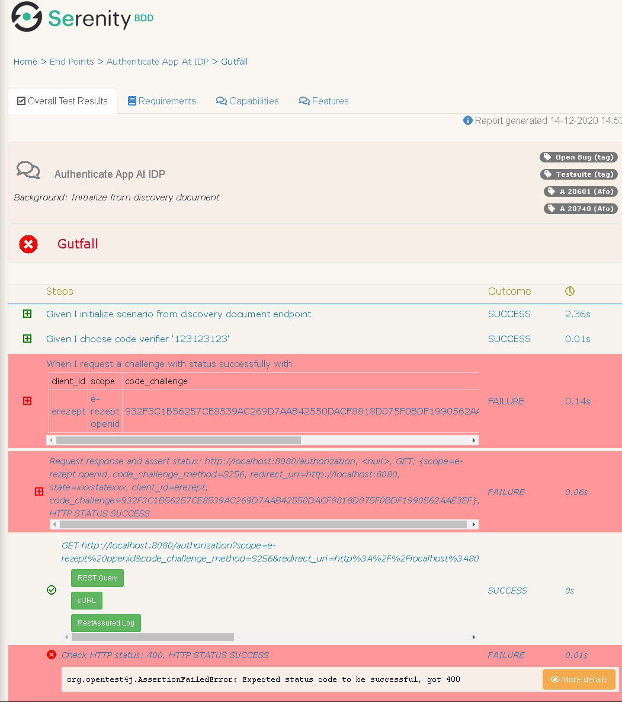
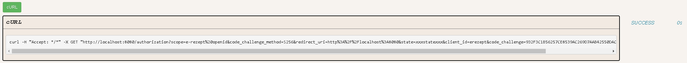
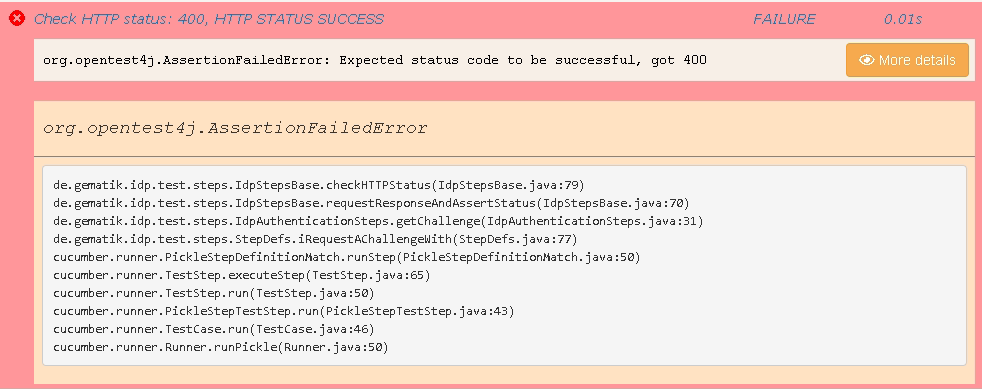

#  Gematik IDP Zulassungstestsuite

<div>Icons made by <a href="https://www.flaticon.com/authors/freepik" title="Freepik">Freepik</a> from <a href="https://www.flaticon.com/" title="Flaticon">www.flaticon.com</a> and Ubuntu Gnome icon set</div>

Die Gematik-IDP-Zulassungstestsuite dient zur Pr&uuml;fung des zentralen IDP Dienstes (IDP Server).
Zusätzlich enthät die Testsuite Tests für den Fast Track und die Föderierten IDPs.
Alle Zulassungstests sind - im Sinne von maven - "Integrationstests". Diese Tests befinden sich in *
.feature Dateien.

Ein Integrationstest kann entweder gegen eine lokale Instanz eines IDP Servers, oder gegen einen
remote verfügbaren
Server durchgeführt werden. Durch Setzen der Umgebungsvariable `IDP_SERVER` wird die Testsuite
angewiesen, gegen den in
der Variable definierten Host/URL zu testen. Existiert diese Umgebungsvariable nicht, so wird von
der Testsuite eine
lokale Instanz des IDP Servers für die Integrationstests verwendet.

## Informationen zum IDP Dienst

Folgende Endpunkte sind von einem IDP Dienst zur Verfügung zu stellen:

* Discovery-Endpunkte (TI und Internet) ("OAuth 2.0 Authorization Server Metadata" [RFC8414])
* Authorization-Endpunkt(e) (Teil des "The OAuth 2.0 Authorization Framework" [RFC6749])
* Token-Endpunkt(e) [RFC6749 # section-3.2] mit
    * "ID_TOKEN" [openid-connect-core 1.0 # IDToken],
    * "ACCESS_TOKEN" [RFC6749 # section-1.4 & RFC6749 # section-5],
    * "REFRESH_TOKEN/SSO_TOKEN" [RFC6749 # section-1.5 & RFC6749 # section-6]
* Pairing-Endpunkt

#### Relevante RFCs

* [RFC6749](https://tools.ietf.org/html/rfc6749) ist der allgemeine OAuth 2.0 RFC. Hier werden die
  Endpunkte (
  Authorization-Endpoint, Token-Endpoint, ...) beschrieben
* [RFC7636](https://tools.ietf.org/html/rfc7636) beschreibt einen Schutzmechanismus gegen das
  Abfangen von Authorization
  Codes. Es wird mit code_verifier gearbeitet und die damit verbundenen Änderungen am
  Authorization-Request finden sich
  in diesem RFC
* [RFC8252](https://tools.ietf.org/html/rfc8252) beschreibt, wie Native Apps OAuth 2.0 machen
  sollen.
* [RFC8414](https://tools.ietf.org/html/rfc8414) beschreibt, wie man über einen Discovery-Endpunkt
  die relevanten
  Endpunkte ermittelt.
* [RFC7519 Appendix A.2](https://tools.ietf.org/html/rfc7519#appendix-A.2) beschreibt, wie das
  Challenge-Token zu
  signieren und verschlüsseln ist (Nested JWT).
* [RFC7515 Ssection 3](https://tools.ietf.org/html/rfc7515#section-3) beschreibt die zu verwendende
  Form der Signatur (
  JSON Web Signature)
* [RFC7516 Section 3](https://tools.ietf.org/html/rfc7516#section-3) beschreibt die zu verwendende
  Form der
  Verschlüsslung (JSON Web Encryption)

## Testüberdeckung

mit dem aktuellen Release sind folgende Testszenarien abgedeckt:

* Discovery Endpunkt
    * Tests über Erreichbarkeit des Endpunkts, Struktur der Antwort, Inhalte der Claims, Signaturen,
      zeitliche
      Gültigkeit, Token Verschlüsselung
* Authorization Endpunkt - Anforderung Challenge Token
    * Tests über Erreichbarkeit des Endpunkts, Eingangsparameter, Struktur der Antwort, Inhalte der
      Claims, Signaturen,
      Negativtests auf Parameter, Fehlermeldungen, zeitliche Gültigkeit, Token Verschlüsselung
* Authorization Endpunkt - Anforderung Tokencode
    * Tests über Erreichbarkeit des Endpunkts, Eingangsparameter, beide Flows (signed challenge, sso
      token), Signaturen,
      Negativtests auf Parameter, Fehlermeldungen, zeitliche Gültigkeit, ungültige Zertifikate,
      Token Verschlüsselung
    * _Abzuklären: Struktur der Antwort, Inhalte der Claims_
    * _In Arbeit: Fehlermeldungen_
    * _Noch nicht realisiert: ungültiger SSO Token_
* Token Endpunkt - Anforderung Access Token
    * Tests über Erreichbarkeit des Endpunkts, Eingangsparameter, beide Flows (signed challenge, sso
      token),
      Signaturen (ID Token), Negativtests auf Parameter, zeitliche Gültigkeit, Ungültige
      Zertifikate, Token
      Verschlüsselung
    * _In Arbeit: Fehlermeldungen_
    * _Noch nicht realisiert: kartenspezifische Szenarien_
* Alternative Authentisierung
    * Gut-/Schlechtfälle zur alternativen Authentisierung
    * Testfälle zur Verwendung der Blocklist
* Pairing Endpunkt - Registrierung / Deregistrierung / Liste
    * Positivfälle, Einige Negativtests

## Installation der notwendigen Software

* OpenJDK (Version in pom: ${version.java})
* Maven
* Jetbrains Intellij (optional)

## Idp Server lokal starten

### via Maven

im Projekt root:

```console
$ cd idp-server 
$ mvn spring-boot:run
```

Es startet eine Instanz auf localhost:8080.

### via java

```console
$ mvn clean package -pl idp-server -am
$ java -jar ./idp-server/target/idp-server-*.jar --idp.loglevel=debug
```

Es startet eine Instanz auf localhost:8080.

### via Intellij

* Projekt in Intellij öffnen

 Beim ersten Mal kann es einige Zeit dauern, bis alle
Projektabhängigkeiten
von Internet/Gematik Nexus Repos gezogen wurden.

* Compile: 
* Den Verzeichnisbaum idp-server → src → main → java → de.gematik.idp.server aufklappen
* Rechte Maus auf die Datei IdpServer
* `Run IdpServer` auswählen <br>



Es startet eine Instanz auf localhost:8080.<br>
Im Run Fenster sind die Logs des gestarteten Servers sichtbar:



Der IdpServer kann für Analysetätigkeiten statt Run auch mit Debug gestartet werden. Dadurch können
im IdpServer code
breakpoints gesetzt und Code schrittweise ausgeführt werden.

Ein Beispiel für den Abruf des Discovery Documents an der lokalen Instanz wäre:

```console
$ curl http://localhost:8080/auth/realms/idp/.well-known/openid-configuration
eyJhbGciOiJCUDI1NlIxIiwidHlwIjoiSldUIiwia2lkIjoicHVrX2Rpc2Nfc2lnIiwieDVjIjpbIk1JSUNzVENDQWxpZ0F3SUJBZ0lIQWJzc3FRaHFPekFLQmdncWhrak9QUVFEQWpDQmhERUxNQWtHQTFVRUJoTUNSRVV4SHpBZEJnTlZCQW9NRm1kbGJXRjBhV3NnUjIxaVNDQk9UMVF0VmtGTVNVUXhNakF3QmdOVkJBc01LVXR2YlhCdmJtVnVkR1Z1TFVOQklHUmxjaUJVWld4bGJXRjBhV3RwYm1aeVlYTjBjblZyZEhWeU1TQXdIZ1lEVlFRRERCZEhSVTB1UzA5TlVDMURRVEV3SUZSRlUxUXRUMDVNV1RBZUZ3MHlNVEF4TVRVd01EQXdNREJhRncweU5qQXhNVFV5TXpVNU5UbGFNRWt4Q3pBSkJnTlZCQVlUQWtSRk1TWXdKQVlEVlFRS0RCMW5aVzFoZEdscklGUkZVMVF0VDA1TVdTQXRJRTVQVkMxV1FVeEpSREVTTUJBR0ExVUVBd3dKU1VSUUlGTnBaeUF6TUZvd0ZBWUhLb1pJemowQ0FRWUpLeVFEQXdJSUFRRUhBMElBQklZWm53aUdBbjVRWU94NDNaOE13YVpMRDNyL2J6NkJUY1FPNXBiZXVtNnFRellENWREQ2NyaXcvVk5QUFpDUXpYUVBnNFN0V3l5NU9PcTlUb2dCRW1PamdlMHdnZW93RGdZRFZSMFBBUUgvQkFRREFnZUFNQzBHQlNza0NBTURCQ1F3SWpBZ01CNHdIREFhTUF3TUNrbEVVQzFFYVdWdWMzUXdDZ1lJS29JVUFFd0VnZ1F3SVFZRFZSMGdCQm93R0RBS0JnZ3FnaFFBVEFTQlN6QUtCZ2dxZ2hRQVRBU0JJekFmQmdOVkhTTUVHREFXZ0JRbzhQam1xY2gzekVORjI1cXUxenFEckE0UHFEQTRCZ2dyQmdFRkJRY0JBUVFzTUNvd0tBWUlLd1lCQlFVSE1BR0dIR2gwZEhBNkx5OWxhR05oTG1kbGJXRjBhV3N1WkdVdmIyTnpjQzh3SFFZRFZSME9CQllFRkM5NE05TGdXNDRsTmdvQWJrUGFvbW5MalM4L01Bd0dBMVVkRXdFQi93UUNNQUF3Q2dZSUtvWkl6ajBFQXdJRFJ3QXdSQUlnQ2c0eVpEV215QmlyZ3h6YXd6L1M4REpuUkZLdFlVL1lHTmxSYzcra0JIY0NJQnV6YmEzR3NwcVNtb1AxVndNZU5OS05hTHNnVjh2TWJESmIzMGFxYWlYMSJdfQ.eyJhdXRob3JpemF0aW9uX2VuZHBvaW50IjoiaHR0cDovL2xvY2FsaG9zdDo4MDgwL3NpZ25fcmVzcG9uc2UiLCJhdXRoX3BhaXJfZW5kcG9pbnQiOiJodHRwOi8vbG9jYWxob3N0OjgwODAvYWx0X3Jlc3BvbnNlIiwic3NvX2VuZHBvaW50IjoiaHR0cDovL2xvY2FsaG9zdDo4MDgwL3Nzb19yZXNwb25zZSIsInVyaV9wYWlyIjoiaHR0cDovL2xvY2FsaG9zdDo4MDgwL3BhaXJpbmdzIiwidG9rZW5fZW5kcG9pbnQiOiJodHRwOi8vbG9jYWxob3N0OjgwODAvdG9rZW4iLCJ0aGlyZF9wYXJ0eV9hdXRob3JpemF0aW9uX2VuZHBvaW50IjoiaHR0cDovL2xvY2FsaG9zdDo4MDgwL2V4dGF1dGgiLCJ1cmlfZGlzYyI6Imh0dHA6Ly9sb2NhbGhvc3Q6ODA4MC8ud2VsbC1rbm93bi9vcGVuaWQtY29uZmlndXJhdGlvbiIsImlzc3VlciI6Imh0dHBzOi8vaWRwLnplbnRyYWwuaWRwLnNwbGl0ZG5zLnRpLWRpZW5zdGUuZGUiLCJqd2tzX3VyaSI6Imh0dHA6Ly9sb2NhbGhvc3Q6ODA4MC9qd2tzIiwiZXhwIjoxNjYwMjIxMDEwLCJpYXQiOjE2NjAxMzQ2MTAsInVyaV9wdWtfaWRwX2VuYyI6Imh0dHA6Ly9sb2NhbGhvc3Q6ODA4MC9pZHBFbmMvandrLmpzb24iLCJ1cmlfcHVrX2lkcF9zaWciOiJodHRwOi8vbG9jYWxob3N0OjgwODAvaWRwU2lnL2p3ay5qc29uIiwic3ViamVjdF90eXBlc19zdXBwb3J0ZWQiOlsicGFpcndpc2UiXSwiaWRfdG9rZW5fc2lnbmluZ19hbGdfdmFsdWVzX3N1cHBvcnRlZCI6WyJCUDI1NlIxIl0sInJlc3BvbnNlX3R5cGVzX3N1cHBvcnRlZCI6WyJjb2RlIl0sInNjb3Blc19zdXBwb3J0ZWQiOlsib3BlbmlkIiwiZS1yZXplcHQiLCJwYWlyaW5nIl0sInJlc3BvbnNlX21vZGVzX3N1cHBvcnRlZCI6WyJxdWVyeSJdLCJncmFudF90eXBlc19zdXBwb3J0ZWQiOlsiYXV0aG9yaXphdGlvbl9jb2RlIl0sImFjcl92YWx1ZXNfc3VwcG9ydGVkIjpbImdlbWF0aWstZWhlYWx0aC1sb2EtaGlnaCJdLCJ0b2tlbl9lbmRwb2ludF9hdXRoX21ldGhvZHNfc3VwcG9ydGVkIjpbIm5vbmUiXSwiY29kZV9jaGFsbGVuZ2VfbWV0aG9kc19zdXBwb3J0ZWQiOlsiUzI1NiJdLCJra19hcHBfbGlzdF91cmkiOiJodHRwOi8vbG9jYWxob3N0OjgwODAvZGlyZWN0b3J5L2trX2FwcHMifQ.esVMUkfx6KhEu9SsTRjExXNLgx2Fwct0GFn3Mq9lzHFr1aPdqlp7jKkLnGjM_XHZmQoRgUPYHxfSWhvWPwK3Kg
```

## Testszenarien / Testsuite ausführen

### Gesamte Testsuite via Maven in Git Bash ausführen

Die Integrationstests umfassen alle 3 Teilprojekte. Die feature Dateien sind dementsprechend
gruppiert. "biometrics"
und "coreFeatures" testen den Idp-Server.

```console
|-idp-testsuite
   ...
   |-----test
   |---------...
   |-------resources
   |---------...
   |---------features
   |-----------biometrics
   |-----------coreFeatures
   |-----------fastTrack
```

Bei der Testausführung wird es meistens sinnvoll sein, zu filtern.
Einen bestimmten Integrationstest ausführen:

```console
$ mvn verify -Dskip.unittests=true -Dcucumber.filter.tags="@TCID:FEDIDP_ENTITY_STATEMENT_003"
```

Alle (in allen Teilprojekten) Zulassungstests ausführen, die u.a. nicht auf "work in progress"
stehen.

```console
$ mvn verify -Dskip.unittests=true -Dcucumber.filter.tags="@Approval and not @OpenBug and not @WiP and not @LongRunning"  
```     

Integrationstests können mit `-Dskip.inttests` disabled werden.

 Die Testsuite startet mehrere Server um alle Testfälle
der Teilprojekte
testen zu können. Das Verhalten kann in der tiger.yaml konfiguriert werden.

Einen bestimmten Integrationstest gegen einen existierenden Idp-Server ausführen:

```console
$ export IDP_SERVER=http://localhost:8080/auth/realms/idp/.well-known/openid-configuration
$ export GEMATIK_TESTCONFIG=default
$ mvn verify -Dskip.unittests=true -Dcucumber.filter.tags="@TCID:IDP_REF_DISC_001"
```

### Testfall der Testsuite in Intellij ausführen/debuggen

* bauen: ```mvn clean package```
* Testfall identifizieren, rechte Maustatste auf "Run Test"
  
* Klick "Modify Run Configuration"
  
* Main Class setzen auf: ```de.gematik.test.tiger.TigerCucumberRunner```
* Glue setzen
  auf: ```de.gematik.test.tiger.glue net.serenitybdd.cucumber.actors de.gematik.idp.test.steps```
  
* Test Result
  
* Testbericht bei Ausführung mit maven: ```./idp-testsuite/target/site/serenity/index.html```
* Testbericht bei Ausführung in
  Intellij: ```./idp-testsuite/target/site/serenity/downloadable/...html```

## Serenity Testbericht

### Testbericht analysieren

#### Übersichtsseite(n)

Die Übersichtsseite besteht aus folgenden Sektionen:

##### Test Results: All Tests

Hier ist der gesamte Testlauf mit allen statistischen Daten und einem netten PieChart aufgelistet

##### Functional Coverage Overview

Zeigt eine Liste aller Features die gefunden/getestet wurden.

##### Tags

Hier sind alle in den Feature Dateien verwendeten Tags aufgelistet. Für uns vor allem interessant
ist die Afo Sektion wo
alle eingetragenen Afos und die Issue Sektion wo alle mit Jira verlinkten Tickets gelistet sind. Ein
Klick auf den
konkreten Tag zeigt die zugehörige Übersichtsseite. Ein Klick auf Test Results zeigt dann alle
verlinkten Szenarien.

 Um in der Feature Ansicht die Testfälle zu sehen muss
oben "Test Results"
ausgewählt werden. Um das konkrete Szenario im Detail zu sehen, dann in der Liste in der Spalte "
SCENARIO" klicken!

#### Testschrittdetails

Durch Klicken auf die links angezeigten "+" icons können weiterführende Details zu den Testschritten
aufgeklappt werden.



Für HTTP Anfragen wird neben dem **"REST Query"** Knopf der von Serenity erstellt wird und die
ausgeführten REST Abfrage
detailliert darstellt auch ein **"cURL"** Knopf dargestellt, welcher einen ausführbaren REST Query
mit Curl erlaubt um
etwaige Fehler nachzustellen.



Für Stacktrace Informationen gibt es rechts in den Details auch den **"More Details"** Knopf



### Nutzung / Anpassung von Testumgebungsvariablen

In der durch die Umgebungsvariable GEMATIK_TESTCONFIG definierten
testsuite_config.${env.GEMATIK_TESTCONFIG}.properties
sind ein Set von mit TESTENV beginnenden Variablen definiert, welche in der Testsuite bei der
Übergabe von String Werten
durch Angabe von ${TESTENV.variablenname} genutzt werden können.

Das für die symmetrische Verschlüsselung von Challenge und Token zu verwendende Passwort wird in den
folgenden Einträgen
gesetzt:

```
encryption.signedchallenge.symmetric.key=geheimerSchluesselDerNochGehashtWird
encryption.ssotoken.symmetric.key=geheimerSchluesselDerNochGehashtWird
encryption.alternativeauthentication.symmetric.key=geheimerSchluesselDerNochGehashtWird
```
